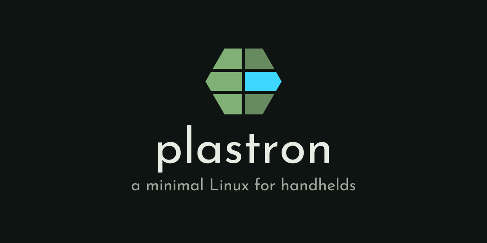

<p align="center">
  
</p>

a minimal Linux for handhelds, built to boot fast and run
[TortOS](https://github.com/ericreinsmidt/TortOS). Its first board is the
GKD Pixel 2 (Rockchip RK3326S, which Linux calls PX30S).

On the TrimUI Brick, TortOS runs on top of TrimUI's own system. The Pixel 2
has no system of its own to run on - the card is the whole OS - so plastron
is that system: as little as it takes to boot fast and run TortOS and
[diatom](https://github.com/ericreinsmidt/diatom), its emulator. A plastron
is the underside of a turtle's shell, the part TortOS sits on.

## Status

TortOS runs on it. The shelf is up about 1.6 s after the kernel starts,
2.9 s from reset and 3.6 s from the power button.

The Pixel 2's hardware all works: the display (Panfrost, with the panel's
colors corrected in the display controller's gamma table), sound with
headphone switching, every button, power, brightness and battery. It has no
Wi-Fi, Bluetooth or rumble, and neither does plastron.

The kernel is kernel.org 7.1.2 with ROCKNIX's patches, config and device tree
from their 20260901 release, and the config cut down to what the Pixel 2
uses. The plan is to carve the patches down too, one at a time, to kernel.org
plus the few this chip actually needs.

The bootloader is ROCKNIX's, with U-Boot rebuilt from source by
`make bootloader` (`buildroot/board/px2/u-boot/`). Rockchip's DDR init,
miniloader and BL31 are still their prebuilt blobs. U-Boot records its own
timings in the device tree it hands Linux (bootstage), so where the
bootloader spends its time can be read on the running device under
`/proc/device-tree/bootstage`, with no serial console.

## Installing

The card image comes with each [TortOS release](https://github.com/ericreinsmidt/TortOS/releases).
Write it to a card with the TortOS installer, or with any program that writes
disk images. It erases the whole card.

The first boot adds an exFAT partition over the rest of the card, for games,
saves and music, which a Mac or PC can read and write (labeled TORTOS).

## Boot time

What's been done to make it boot fast, step by step and with measurements,
is in [docs/boot-time.md](docs/boot-time.md). How TortOS and diatom were
brought over from the Brick is in [docs/tortos-plan.md](docs/tortos-plan.md).

## Building

Needs Docker. Everything else - the cross-compiler included - Buildroot
builds from source inside the container. TortOS and diatom are built from
their own checkouts, mounted into the container (see the Makefile).

```sh
make                # out/sdcard.img: TortOS on the base system
make base           # out/sdcard-base.img: the base system alone
make linux-rebuild  # just the kernel, after changing its config or patches
make bootloader     # U-Boot -> buildroot/board/px2/bootloader/u-boot-px2.bin
make shell          # a shell in the build container
```

The first build takes a while: it builds the whole toolchain. After that,
Buildroot only rebuilds what changed.

To get SSH access, put a public key in `local/authorized_keys` before
building. `local/` is not tracked.

## On the device

Write `out/sdcard.img` to a card from sector 0. On the device, the card's
exFAT partition is mounted at `/mnt/SDCARD` (labeled TORTOS, or PIXEL2 on the
base image).

With the USB cable plugged into a Mac, the Pixel appears as a network
interface:

```sh
ssh root@fe80::70:78ff:fe32:1%en10
```

(`en10` is whatever interface macOS assigned it; `networksetup
-listallhardwareports` names it "GKD Pixel 2".)

## Layout

```
buildroot/                  a Buildroot external tree (BR2_EXTERNAL)
  configs/px2_defconfig     the base Pixel 2 system: boots, display, sound,
                            buttons, power, nothing TortOS-specific
  board/tortos/             TortOS on top: tortos.config (merged into the
                            base config) and its rootfs overlay
  package/                  our packages (splash, Panfrost, jackswitch, ...)
  board/px2/
    linux.config            kernel config, derived from ROCKNIX's RK3326
                            one by scripts/kernel-config.sh
    patches/linux/          kernel patches, numbered in the order they apply
    dts/                    the Pixel 2 device tree (ROCKNIX's)
    bootloader/             the bootloader written at sector 64: ROCKNIX's,
                            and ours with U-Boot rebuilt (u-boot-px2.bin)
    u-boot/                 U-Boot's patches, ROCKNIX's sources, our config
    boot.cmd                the U-Boot boot script
    genimage.cfg            the card layout
    rootfs-overlay/         files added to the root filesystem
docker/                     the build container
scripts/build.sh            runs Buildroot inside it
scripts/make-logo.py        draws docs/plastron.svg and the card above
```

## License

MIT for plastron's own files. The kernel and U-Boot patches, the device tree
and the bootloader keep their own licenses; [LICENSE](LICENSE) lists them.
The card image carries the licenses and sources of everything in it, which
Buildroot collects with `make legal-info`.
